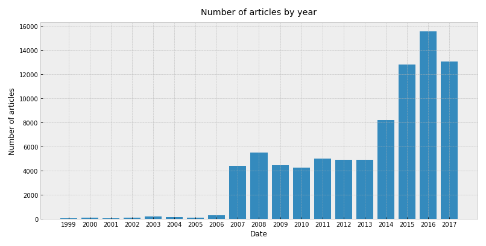
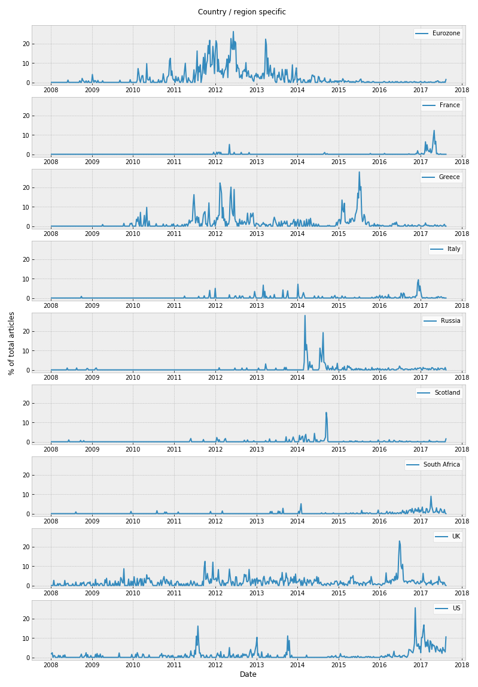
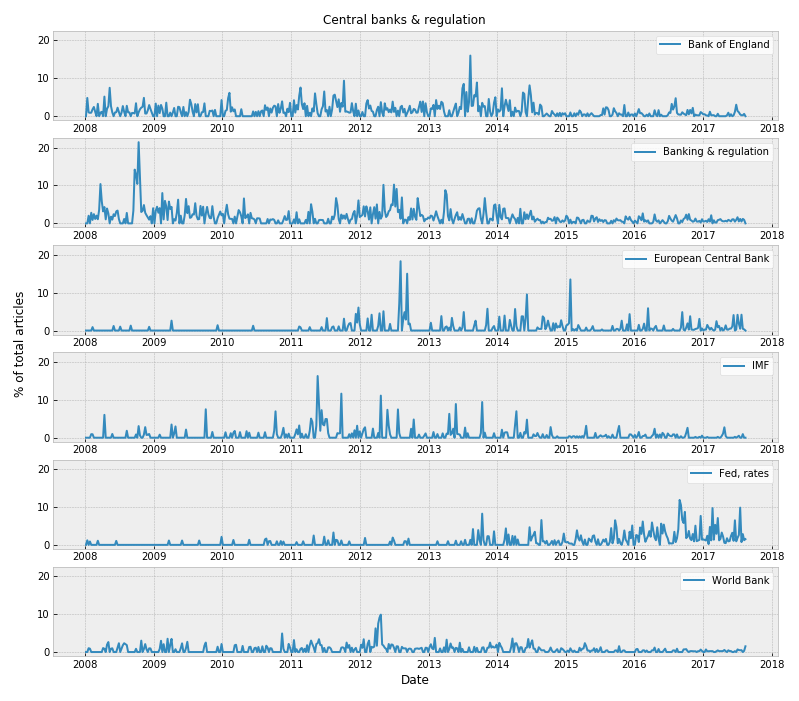
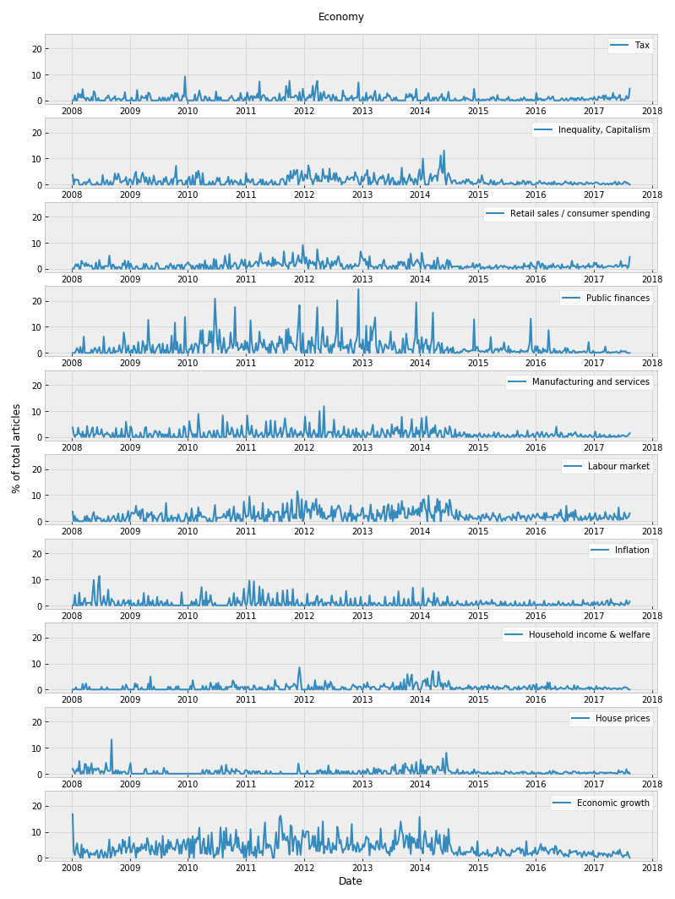

# Topic Modelling on Financial News Articles

## Summary

This repo contains code for pre-processing and vectorizing raw text collected from 85,000 news articles downloaded from a variety of online broadsheet newspapers and newswires covering finance, business and the economy.

A detailed blog post can be found at http://mattmurray.net/topic-modelling-financial-news-with-natural-language-processing/

The data was pre-processed with the removal of stop words, punctuation and numbers, and the words were stemmed using the Snowball stemmer.

The data was vectorized into a TF-IDF matrix, then Latent Semantic Analysis techniques were applied to reduce the dimensions into a smaller number of latent features.

Finally, the latent features were clustered into topic clusters and the trends in the topics visualized over time.

## Outcome

  

  

  

